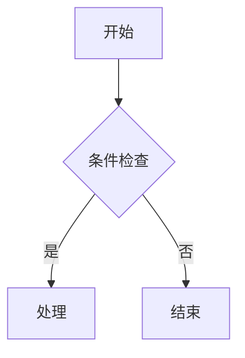
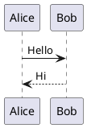

## Frontmatter 模板

```yaml
---
title: 文章标题
published: 2026-06-30        # 发布日期
updated: 2026-06-30          # 更新日期（可选）
description: 文章摘要
image: ./images/cover.avif   # 封面图路径（可选，可设为 api 自动生成）
tags: [标签1, 标签2]
category: 分类名
draft: false                 # true=草稿（不公开）
pinned: false                # true=置顶
password: ""                 # 加密密码（可选，不设即不加密）
passwordHint: ""             # 密码提示（可选）
author: ""                   # 作者（可选）
sourceLink: ""               # 原文链接（可选）
licenseName: ""              # 授权名称（可选）
comment: true                # 是否开启评论
---
```

## 基础 Markdown

### 标题
```md
# 一级标题
## 二级标题
### 三级标题
```

### 强调
```md
*斜体*  _斜体_
**粗体**  __粗体__
~~删除线~~
```

### 列表
```md
- 无序列表项
- 无序列表项

1. 有序列表项
2. 有序列表项

- 父项
  - 嵌套子项
```

### 引用
```md
> 单层引用
>
> > 嵌套引用
```

### 链接
```md
[文字链接](https://example.com)
[文字链接](https://example.com "标题")
<https://example.com>   （自动链接）
```

### 图片
```md


```

### 表格
```md
| 左对齐 | 居中 | 右对齐 |
| :--- | :---: | ---: |
| 内容 | 内容 | 内容 |
```

### 分割线
```md
---
```

## 代码块 (Expressive Code)

### 语法高亮
````md
```js
console.log('Hello')
```
````

常用语言标识：`js` `ts` `html` `css` `python` `bash` `json` `yaml` `rust` `go` `ruby` `diff` `ansi` `mermaid` `plantuml`

### 标题与框架
````md
```js title="my-file.js"
// 显示标题
```
````

```sh frame="none"
# 无框架
```

```bash
# 终端框架（bash/powershell/sh 默认终端样式）
```

```ps frame="code" title="PowerShell Profile.ps1"
# 强制代码编辑器框架
```

### 行标记 (mark / ins / del)
````md
```js {1, 4, 7-8}           # 高亮指定行
```
```js del={2} ins={3-4}      # 删除/插入标记
```
```js "highlight text"       # 高亮指定文本
```
```diff                       # diff 语法自动标记
+ 插入行
- 删除行
```
````

### 其他代码块选项
````md
```js showLineNumbers                    # 显示行号
```
```js showLineNumbers startLineNumber=5  # 自定义起始行号
```
```js collapse={1-5, 12-14}             # 折叠指定行
```
```js wrap                               # 启用自动换行
```
```js wrap=false                         # 禁用自动换行
```
````

## 提示框 (Admonitions)

### GitHub 风格（当前主题默认）
```md
> [!NOTE] 注意
> 突出显示用户应该考虑的信息。

> [!TIP] 提示
> 可选信息，帮助用户更成功。

> [!IMPORTANT] 重要
> 用户成功所必需的关键信息。

> [!WARNING] 警告
> 关键内容，需要立即注意。

> [!CAUTION] 危险
> 行动的负面潜在后果。
```

### Obsidian 风格额外类型
```md
> [!INFO] / > [!SUCCESS] / > [!QUESTION] / > [!DANGER] / > [!ERROR] / > [!BUG]
> [!EXAMPLE] / > [!QUOTE] / > [!ABSTRACT] / > [!TODO] / > [!FAILURE]
```

### Docusaurus 风格
```md
:::note
内容
:::

:::tip[自定义标题]
内容
:::

类型：`note` `tip` `info` `warning` `danger`
```

## Firefly 特殊语法

### GitHub 仓库卡片
```md
::github{repo="CuteLeaf/Firefly"}
```

### 剧透文字
```md
内容 :spoiler[被隐藏的文字，支持 **Markdown**] 继续
```

### 图片网格
```md
[grid]


[/grid]
```
最多并排 4 张，自动响应式排列，高度不一致时自动裁剪补齐。

### 文章加密
在 frontmatter 中添加：
```yaml
password: "密码"
passwordHint: "提示信息"
```
内容在构建时用 AES-256-GCM 加密，浏览器端解密。同一会话内缓存密码。

## Mermaid 图表

````md

````

支持类型：流程图 (`graph`)、时序图 (`sequenceDiagram`)、甘特图 (`gantt`)、类图 (`classDiagram`)、状态图 (`stateDiagram-v2`)、饼图 (`pie`)

## PlantUML 图表

````md

````

支持类型：时序图、活动图、类图、用例图、状态图、组件图、部署图、ER 图、C4 容器图

## KaTeX 数学公式

```md
行内：$e^{i\pi} + 1 = 0$ 或 $E = mc^2$

块级：
$$
\int_{-\infty}^{\infty} e^{-x^2} dx = \sqrt{\pi}
$$

矩阵：
$$
\begin{pmatrix}
a & b \\
c & d
\end{pmatrix}
$$

化学：
$$
\ce{CH4 + 2O2 -> CO2 + 2H2O}
$$
```

## 视频嵌入

```md
## YouTube
<iframe width="100%" height="468" src="https://www.youtube.com/embed/VIDEO_ID" title="YouTube video player" frameborder="0" allowfullscreen></iframe>

## Bilibili
<iframe width="100%" height="468" src="//player.bilibili.com/player.html?bvid=BVID&p=1&autoplay=0" scrolling="no" border="0" frameborder="no" framespacing="0" allowfullscreen="true"></iframe>
```

## 内联 HTML

```md
<span>行内 HTML 中 **可以** 解析 Markdown</span>

<div>
块级 HTML 中 **不会** 解析 Markdown
</div>
```

## MDX（高级）

`.mdx` 文件可导入组件并使用 JSX：

```mdx
---
title: 文章标题
published: 2026-01-01
---

import { Icon } from 'astro-icon/components'

<div class="flex items-center gap-2">
  <Icon name="fa7-solid:rocket" class="text-4xl text-red-500" />
  <span>火箭发射！</span>
</div>

export const year = new Date().getFullYear()
今年是 {year} 年。
```

---

## 追番数据更新流程

数据来源：**Cycani（次元城）收藏页** + **Bangumi API（评分和简介）**

```
Cycani HTML → 脚本解析番剧列表 → 封面图 URL 提取 Bangumi ID → 调用 Bangumi 镜像 API 获取评分和简介 → 生成 JSON → 页面展示
```

封面图使用 Cycani（百度图床），评分和简介来自 Bangumi。

### 技术细节

- **封面图来源**：Cycani 的百度图床（`gimg1.baidu.com`），gimg 是百度图片的外链服务，URL 内嵌了原始 cycani CDN 地址
- **Bangumi ID 提取**：从封面图 URL 中正则提取（如 `480441_6o9oX.jpg` → 提取 ID `480441`）
- **Bangumi API**：使用镜像 `https://bgmapi.anibt.net/v0/`（官方 `api.bgm.tv` 国内不可达）
  - 先按 ID 直查：`/v0/subjects/{id}`
  - 查不到则按标题搜索：`/v0/search/subjects?keyword=标题&type=2`
  - 搜索命中后再查详情获取评分
- **数据字段**：标题（优先 `name_cn`）、原始标题（`name`）、评分（`rating.score`）、简介（`summary`）、日期（`date`）
- **输出文件**：`public/anime-list.json`，格式为 `StandardizedAnime[]`

### 更新步骤
1. 浏览器打开 `https://www.cycani.org/user/favs.html`（确保已登录）
2. `Ctrl+S` 另存为 HTML，保存到桌面
3. 告诉 Claude Code：把桌面的 favs HTML 更新到项目
4. Claude Code 自动：复制文件 → 运行 `npx tsx scripts/generate-cycani-data.ts` → 提交推送
5. Vercel 自动部署

> **Claude Code 使用说明**：发给我的 TXT 只需包含标题和大致内容，我会根据此参考表自动完成 frontmatter、Markdown 格式、转义、图表、公式等所有工作。有特殊需求（加密、流程图、公式等）请在 TXT 中注明。
